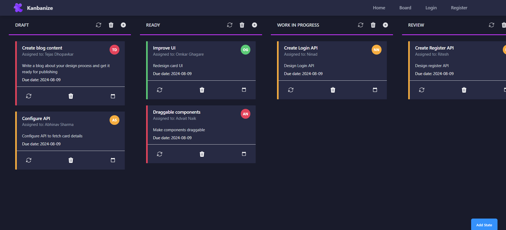

# Kanban Board

This repository contains the code for a full stack Kanban board.

## Features
1. Login and authentication
2. Create a Kanban board
3. Create cards and states
4. Delete cards and states
5. Update cards
6. Drag cards between columns
7. Sort the cards vertically

## Technology Stack

| Technology | Command |
| --- | --- |
| ReactJS | npm create vite@latest |
| React-Router-Dom | npm i react-router-dom |
| Tailwind CSS | npm install -D tailwindcss postcss autoprefixer |

## Front-end Components
1. Header
2. Footer
3. Board
4. Column
5. Card
6. Add State Modal
7. Create Card Modal
8. Delete State Modal
9. Update/Delete Card Modal

## UI Design

### Home Page

### Kanban Board

